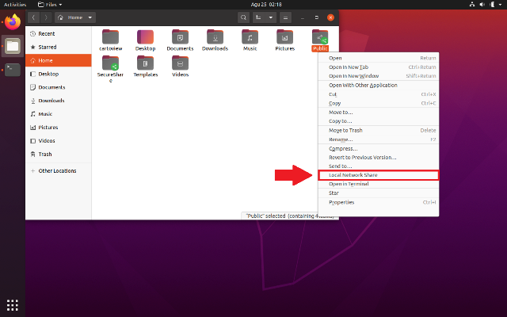
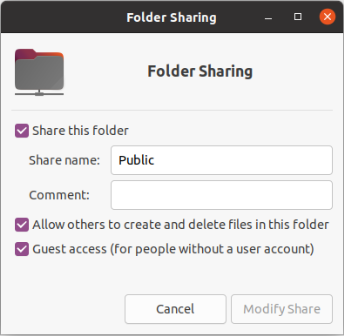
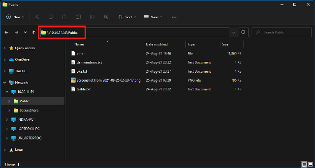
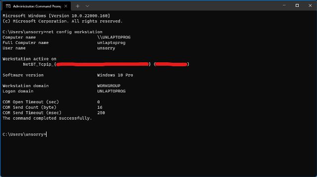
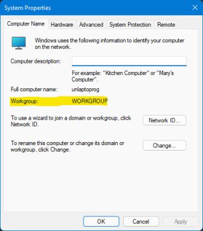

# Local Network Share Ubuntu - Windows
Share direktori/folder pada local network dari ubuntu ke windows menggunakan samba
#

## Install Samba   
`$ sudo apt-get update`   
`$ sudo apt-get install samba`   

___   
## Share Public Folder    
Ubah _folder permission_ supaya semua pengguna dapat _create, edit, delete file/folder_   
`$ sudo -R 0777 /home/<YOURUSERNAME>/Public`   
   
## Melalui samba config   
**Open samba config**
`$ sudo nano /etc/samba/smb.conf`   

**Pastikan workgroup berada pada default WORKGROUP**   
`# Change this to the workgroup/NT-domain name your Samba server will part of`   
`workgroup = WORKGROUP`   

**Tambahkan di bagian paling bawah syntax ini**   
`[Public]`   
`path = /home/<YOURUSERNAME>/Public`   
`browsable = yes`   
`writable = yes`   
`guest ok = yes`   
`read only = no`   

**Simpan perubahan samba config**   

**Restart samba service**   
`$ sudo systemctl restart smbd`   
   
## Pada Ubuntu Desktop
**Jika menggunakan Ubuntu Desktop bisa menggunakan cara ini**   
1. Klik kanan folder yang akan di-_share_
2. Pilih **Local Network Share**   

3. Centang **Share this folder**, **Allow others to create and delete files in this folder**, dan **Guest access (for people without a user account)**    
   

## Restart samba service   
`$ sudo systemctl restart smbd`   

## Allow port for Samba   
`$ sudo ufw allow 137/udp`   
`$ sudo ufw allow 138/udp`   
`$ sudo ufw allow 139/tcp`   
`$ sudo ufw allow 445/tcp`   

___   
## Akses folder dari Windows   
1. Buka **Windows Explorer**   
2. Pada directory/address bar ketikkan   
`\\<IP_ADDRESS_UBUNTU>\Public`   
Contoh:   
`\\10.20.11.59\Public`   
   
   
## Cek Windows Workgroup Domain
1. Buka Windows Terminal/Command Prompt/Power Shell
2. Ketikkan command   
`net config workstation`   
   
3. Atau dari **System Properties** melalui klik kanan **This PC > Properties > Advanced System Settings > Computer Name**  
   
   
___   
## Membuat SecureShare folder dengan login user   
**Membuat samba grup user**   
`$ sudo addgroup smbgrp`   

**Buat user di dalam grup samba**   
`$ sudo usermod unsorry -aG smbgrp`   
`$ sudo smbpasswd -a unsorry`   

Akan muncul command untuk membuat password seperti ini   
`[sudo] password for unsorry:`   
`New SMB password:`   
`Retype new SMB password:`   

> di sini saya menggunakan user dengan nama *unsorry*   

**Install libpam-winbind package**   
Digunakan untuk menyinkronkan pengguna dan kata sandi sistem dengan database pengguna samba    
`$ sudo apt install libpam-winbind`   

**Buat secure share folder**   
`$ mkdir /home/<YOURUSERNAME>/SecureShare`   

**Atur permission yang sesuai pada direktori/folder**   
`$ sudo chmod -R 0770 /home/<YOURUSERNAME>/SecureShare`   
`$ sudo chown -R root:smbgrp /home/<YOURUSERNAME>/SecureShare`   

**Open Samba config**   
`$ sudo sudo nano /etc/samba/smb.conf`   

**Tambahkan syntax**   
`[Secure]`   
`comment = Secure File Server Share`   
`path =  /home/<YOURUSERNAME>/SecureShare`   
`valid users = @smbgrp`   
`guest ok = no`   
`writable = yes`   
`browsable = yes`   

**Simpan samba config**   

**Restart samba service**   
`$ sudo systemctl restart smbd`   

**Access folder from Windows**    
1. Buka **Windows Explorer**   
2. Pada directory/address bar ketikkan   
`\\<IP_ADDRESS_UBUNTU>\SecureShare`   
Contoh:   
`\\10.20.11.59\SecureShare`   

3. Masukkan **username** dan **password** yang telah dibuat sebagai member grup dari **@smbgrp**

#
> Source:   
> https://adrianmejia.com/how-to-set-up-samba-in-ubuntu-linux-and-access-it-in-mac-os-and-windows/   
> https://www.tecmint.com/install-samba-on-ubuntu-for-file-sharing-on-windows/